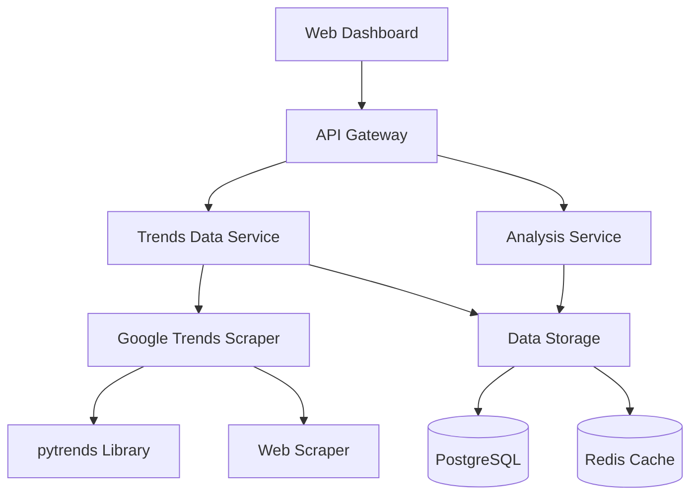

# Design Document

## Overview

本系统专注于Google Trends数据的抓取和分析，采用简洁的架构设计，包含数据抓取服务、数据分析服务和简单的Web界面。系统使用Python作为主要开发语言，通过非官方API和网页抓取技术获取Google Trends数据，并提供深入的趋势分析和关键词洞察。

## Architecture



## Components and Interfaces

### 1. Trends Data Service
**职责**: 负责从Google Trends获取数据并存储

**核心组件**:
- `TrendsCollector`: 使用pytrends库获取趋势数据
- `WebScraper`: 备用的网页抓取器
- `DataNormalizer`: 数据清洗和标准化
- `RateLimiter`: 请求频率控制

**接口**:
```python
class TrendsDataService:
    def get_trending_keywords(self, region: str = 'US', timeframe: str = 'today') -> List[TrendKeyword]
    def get_keyword_details(self, keyword: str) -> KeywordDetails
    def get_related_keywords(self, keyword: str) -> List[str]
```

### 2. Analysis Service
**职责**: 分析关键词的商业价值和竞争程度

**核心组件**:
- `TrendAnalyzer`: 趋势分析算法
- `CompetitionChecker`: 竞争度评估
- `DomainChecker`: 域名可用性检查
- `ValueCalculator`: 商业价值计算

**接口**:
```python
class AnalysisService:
    def analyze_keyword_potential(self, keyword: str) -> KeywordAnalysis
    def check_domain_availability(self, keyword: str) -> List[DomainInfo]
    def calculate_competition_score(self, keyword: str) -> float
```

### 3. Web Dashboard (简化版)
**职责**: 提供数据查看和分析界面

**核心组件**:
- `TrendsDashboard`: 趋势数据仪表板
- `KeywordExplorer`: 关键词浏览和搜索
- `AnalyticsViewer`: 分析结果展示
- `DataExporter`: 数据导出功能

## Data Models

### TrendKeyword
```python
@dataclass
class TrendKeyword:
    keyword: str
    search_volume: int
    growth_rate: float
    region: str
    category: str
    timestamp: datetime
    related_keywords: List[str]
```

### KeywordAnalysis
```python
@dataclass
class KeywordAnalysis:
    keyword: str
    potential_score: float
    competition_level: str
    domain_suggestions: List[str]
    content_ideas: List[str]
    estimated_traffic: int
```

### TrendsReport
```python
@dataclass
class TrendsReport:
    id: str
    keyword: str
    analysis_date: datetime
    trend_data: List[TrendKeyword]
    analysis_results: KeywordAnalysis
    recommendations: List[str]
```

## Error Handling

### 1. API限制处理
- 实施指数退避重试策略
- 使用多个代理IP轮换
- 缓存机制减少API调用

### 2. 数据质量保证
- 数据验证管道
- 异常数据过滤
- 数据完整性检查

### 3. 系统容错
- 服务降级机制
- 断路器模式
- 健康检查端点

## Testing Strategy

### 1. 单元测试
- 每个服务组件的独立测试
- Mock外部API调用
- 数据处理逻辑验证

### 2. 集成测试
- 服务间通信测试
- 数据库操作测试
- 外部API集成测试

### 3. 端到端测试
- 完整工作流程测试
- 用户界面自动化测试
- 性能基准测试

## 技术栈

### 后端
- **Python 3.9+**: 主要开发语言
- **FastAPI**: Web框架
- **pytrends**: Google Trends非官方API
- **BeautifulSoup4**: 网页抓取
- **PostgreSQL**: 主数据库
- **Redis**: 缓存和任务队列
- **Celery**: 异步任务处理

### 前端
- **Streamlit**: 快速数据应用框架
- **Plotly**: 交互式数据可视化
- **Pandas**: 数据处理和展示

### 基础设施
- **Docker**: 容器化部署
- **Nginx**: 反向代理
- **GitHub Actions**: CI/CD

## 安全考虑

1. **API密钥管理**: 使用环境变量和密钥管理服务
2. **请求限制**: 实施请求频率限制防止滥用
3. **数据加密**: 敏感数据加密存储
4. **输入验证**: 严格的输入验证和清理